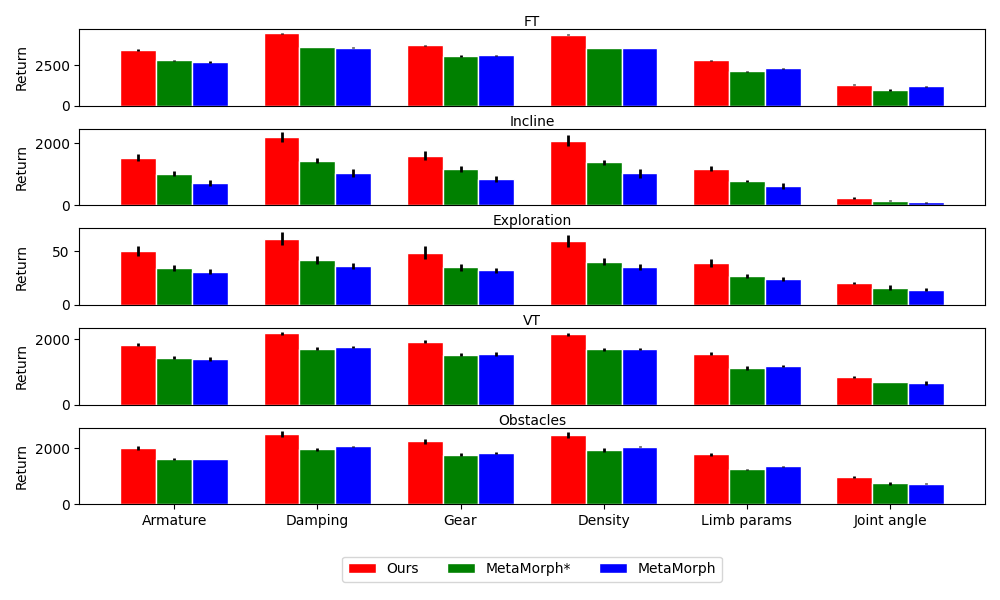

This figure shows the results of zero-shot generalization to unseen morphologies with the same graphs as seen during training but different dynamics or kinematics parameters. 

The rows correspond to the 5 environments, and the columns correspond to parametric variations in 6 different morphology context. 
Our method consistently outperforms the baselines, with an average improvement ratio of 26\%, 50\%, 43\%, 28\%, 30\% in each environment respectively. 
This again proves that our method not only enables better multi-robot training, but also generalizes better to unseen robots. 

However, we also notice that zero-shot generalization to kinematics variation (especially joint angles) is much harder, as is also reported in the [MetaMorph](https://arxiv.org/pdf/2203.11931.pdf) paper. 
This is mainly because that changes in joint
angles may significantly influence the feasible actions and the gait required for locomotion, and how to tackle this challenge is an interesting direction for future work.   
