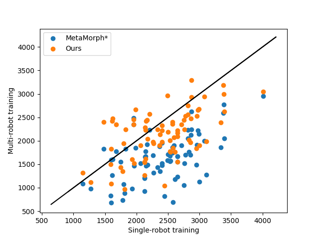

This figure gives an example comparison of per-robot performance with single-robot (SR) and multi-robot (MR) training in the VT environment. 

The X axis corresponds to per-robot return after SR training, and the Y axis corresponds to per-robot return after MR training. 
The per-robot performance is generally aligned, as most points concentrate near the diagonal line in the figure. 
You can also see that our method (the orange points) consistently improves upon the MetaMorph* baseline (the blue points) w.r.t. per-robot performance. 
