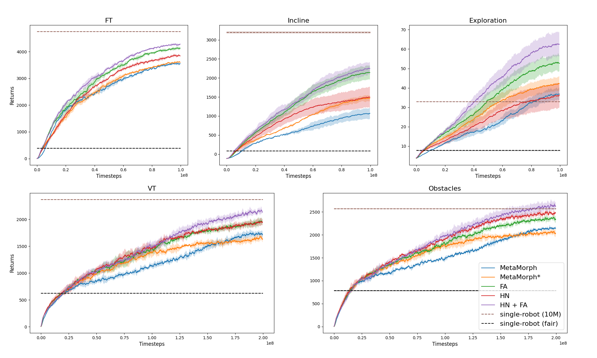

We report additional results of single-robot (SR) training under two different training budgets. 

First, we do SR training with the same per-robot budget for a fair comparison w.r.t. sample efficiency (the black dashed line in the figure). 
E.g., if we do multi-robot (MR) training on 100 robots with 100M steps, then we do SR training with 1M steps on each robot. 
Under this setting, MR training significantly outperforms SR training, which validates the advantage of MR learning in sample efficiency. 

Second, we compare with SR training for 10M steps on each robot, which serves as a performance upper bound, as the SR learning curve converges after 10M steps on most robots (the brown dashed line in the figure). 
Compared to the MR training baselines, our method reduces the performance gap to this upper bound in four environments, and even significantly outperforms SR learning in the Exploration environment, which validates the effectiveness of our method. 
Moreover, note that the MR learning budget is just 1/10 (for FT, Incline, Exploration) or 1/5 (for VT, Obstacles) of the total budget for SR training (100$\times$10M), and we expect that their gap could be further reduced if we do MR training for a longer time. 

In addition to the training performance, we also want to highlight that our method and other MR baselines can zero-shot generalize to unseen morphologies, while SR training can't.   
